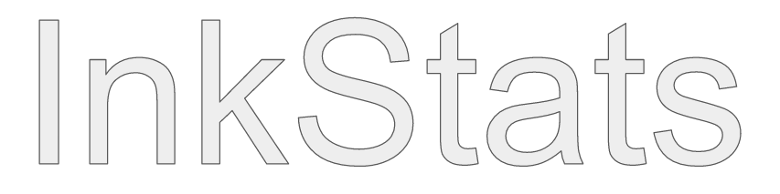

<h1 align="center">

InkStats v2

</h1>

  A new InkStats in Typescript

  A Basic Nodejs Server Status Information app.
  

  
  
  
  
  
  

  

  
  

## Table of Contents
- [Table of Contents](#table-of-contents)
  - [Requirements](#requirements)
  - [Installing](#installing)
  - [About this Project](#about-this-project)
  - [Running the App](#running-the-app)
  - [Building for Source](#building-for-source)
  - [Status of Project](#status-of-project)
  - [Notes](#notes)

### Requirements
- `npm` or `yarn`

### Installing
`npm i -g inkstats-v2` or `yarn add inkstats-v2`

### About this Project
This is v2 of [Inkstatus](https://github.com/Lucaslah/InkStatus)

### Running the App
1. Install InkStats v2 [Here](#Installing)
2. Run: `inkstats-v2 serve` in your terminal
3. If you want to run InkStats on a different port do: `inkstats-v2 serve --port=PORT`

### Building for Source
1. Clone the Repo: `git clone https://github.com/Lucaslah/InkStats-v2.git`
2. `cd InkStats-v2`
3. Install Required Stuff: `yarn` or `npm install`
4. Start the app: `yarn start serve` or `npm start serve`

### Status of Project
- [x] Get Started on Backend
- [x] Get started on Frontend
- [ ] Finish Backend
- [ ] Finish Frontend

### Notes
- This app is still in develment, If you find any bugs open an issue
- By Default this app runs on port `8080`
