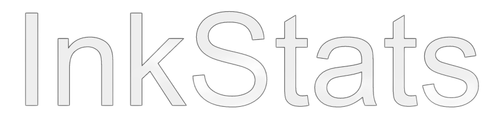

<h1 align="center">

</h1>
<p align="center">
  A Nodejs Server Stats & Information app.
  </p>
<p align="center">
  
  
  
  
  
  </p>
  <p align="center">
  
  </p>

## InkStats CLI

InkStats CLI can be downloaded with npm or yarn

- npm: `npm i -g inkstats-v2`
- yarn `yarn add inkstats-v2`

### Basic Usage
- Basic Server: `inkstats-v2 serve`
- Chanage the Port: `inkstats-v2 serve --port=port`
- Debug Mode: `inkstats-v2 --debug`

## InkStats Module

InkStats Module can be installed with npm or yarn

- yarn: `yarn add inkstats-v2`
- npm: `npm i --save inkstats-v2`

### Example Usage
```javascript
const { InkStats } = require('inkstats-v2')

const server = new InkStats({
name: 'string', // Name if your InkStats Instance
port: number, // Port for InkStats to run on
message: 'string' // Message to be logged to your console when InkStats starts
})

server.start() // Starts the Server
server.kill() // Stops the Server
```

## Information that InkStats Shows
- Total Ram
- CPU Speed
- CPU Cores
- CPU Information
- Platform
- Computer Uptime
- More Coming soon

## Documentation
See the [Wiki](https://github.com/Lucaslah/InkStats-v2/wiki)
